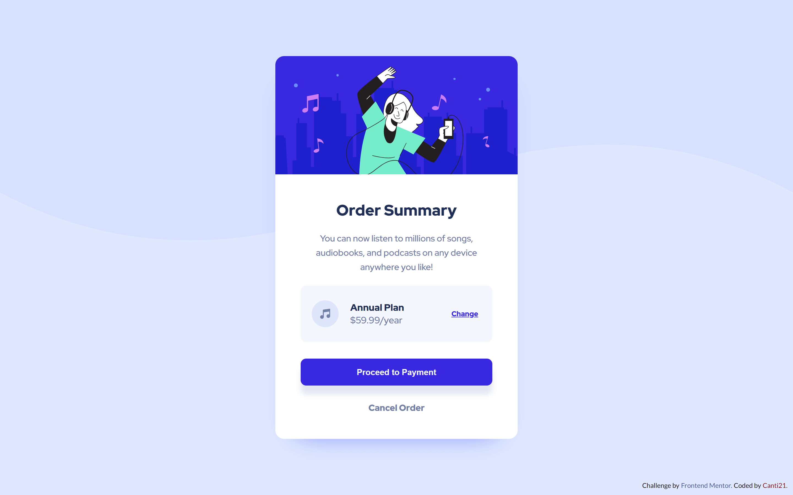

# Frontend Mentor - Order summary card solution

This is a solution to the [Order summary card challenge on Frontend Mentor](https://www.frontendmentor.io/challenges/order-summary-component-QlPmajDUj).

## Overview

### 🎯 The challenge

Users should be able to:

- See hover states for interactive elements

### 📷 Screenshots

🖥️ Desktop View:

📱 Mobile View:

**🌟 Active States:**

### 🔗 Links

- Solution URL: [FrontendMentor]()
- Live Site URL: [Deploy]()

## 💭 My process

### 🛠 Built with

- Semantic HTML5 markup
- CSS custom properties
- Flexbox
- CSS Grid
- Mobile-first workflow

## 🐱‍👤 Author

- Frontend Mentor - [@Canti21](https://www.frontendmentor.io/profile/Canti21)
- Twitter - [@Canti2100](https://www.twitter.com/Canti2100)
